<h1 align="center">Hi 👋, I'm Heriniaina</h1>

  I am a JavaScript/TypeScript developer specializing in the MERN stack, building robust and modern web applications.

- 🌱 I’m currently learning **NEST and NEXTJS**. 
- 💻 Check out my portfolio: https://heriniaina-terminal.vercel.app/
<!--

---
-->
<h3 align="left">Languages and Tools:</h3>

<!---->

<!---->

<h3 align="left">📊 GitHub Stats:</h3>

  <!--
  
  -->
 <picture>
  <source
    srcset="https://github-readme-stats.vercel.app/api?username=Heriiniiaina&show_icons=true&theme=dark"
    media="(prefers-color-scheme: dark)"
  />
  <source
    srcset="https://github-readme-stats.vercel.app/api?username=Heriiniiaina&show_icons=true"
    media="(prefers-color-scheme: light), (prefers-color-scheme: no-preference)"
  />
  
</picture>

---

<h3 align="left">🏆 Contribution Stats:</h3>

  

---

<h3 align="left">📈 Most Used Languages:</h3>

   
<!--    -->

<!--

    
 
 

-->
<!--

-->
---
<!--
<h2 align="center">💻 My mini projects</h2>

---
-->
<!--
<h3 align="left">📈 Project 1: Note Management System</h3>

  <strong>Note Management System</strong>Note Management System is a simple web app that allows users to create, delete, and update notes quickly. Perfect for organizing ideas and tasks with an easy-to-use interface.  

  <a href="https://notesmemos.netlify.app/" target="_blank">
    <strong>Click here to explore the live project!</strong>
  </a>

-->
---

<!--
<h3 align="left">Connect with me:</h3>

  

-->
---
