<h1 align="center">Hi 👋, I'm Heriniaina</h1>

  I am a JavaScript developer specializing in the MERN stack, building robust and modern web applications.

- 🌱 I’m currently learning **React and TypeScript**.

---

<h3 align="left">Languages and Tools:</h3>

<h3 align="left">📊 GitHub Stats:</h3>

  

---

<h3 align="left">🏆 Contribution Stats:</h3>

  

---

<h3 align="left">📈 Most Used Languages:</h3>

  

---

---

<h3 align="left">Connect with me:</h3>

  

---
